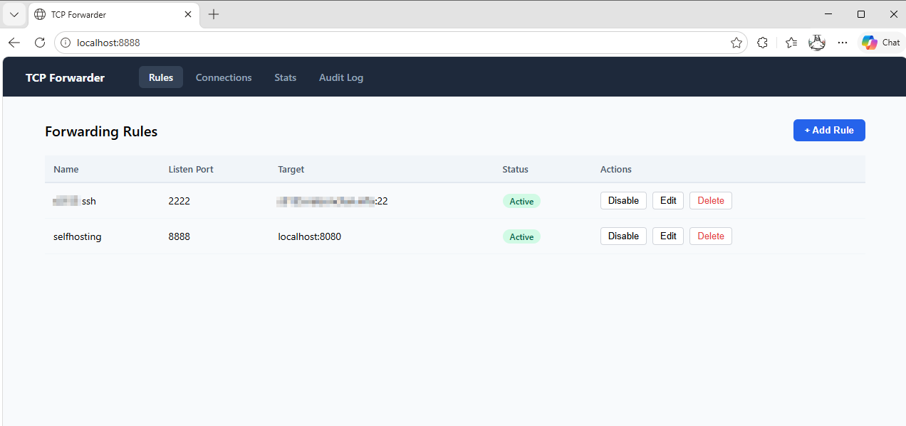

# TCP Forwarder

Listen on a port and forward traffic to a target host and port.

## Features

TCP Forwarder provides a web-based interface to manage port forwarding rules dynamically:



- **Rules Management**: Create, edit, and delete forwarding rules via the web UI
- **Real-time Monitoring**: Track active connections and rule status
- **Audit Logging**: All operations are logged for security and debugging
- **Dynamic Port Mapping**: Add forwarding rules without restarting the service
- **Persistent Configuration**: Rules are saved to disk and survive container restarts
- **Simple CLI Mode**: Quick ad-hoc port forwarding without the web UI overhead

## Build

```bash
mvn install

# or with installation
mvn clean package
```

## Usage

### Local Execution
The application runs as a Spring Boot web server with a management UI.

```bash
java -jar target/tcpforwarder-1.0-SNAPSHOT.jar
# The application starts on http://localhost:8080
```

**Configuration:**
- Set the API key (for securing the management API):
```bash
java -jar target/tcpforwarder-1.0-SNAPSHOT.jar --forwarder.api-key=yoursecretkey
```

- Change the port:
```bash
java -jar target/tcpforwarder-1.0-SNAPSHOT.jar --server.port=9090
```

Once running, open your browser to `http://localhost:8080` to access the web UI and create forwarding rules.

### Simple Forwarder (Ad-hoc CLI Mode)
For quick, one-time port forwarding without the overhead of the full web application, use the SimpleForwarder CLI:

```bash
java -jar target/tcpforwarder-*-simple-forwarder.jar <listenPort> <targetHost> <targetPort>
```

**Example:**
```bash
java -jar target/tcpforwarder-1.0-SNAPSHOT-simple-forwarder.jar 8000 google.com 80
```

The forwarder will run in the foreground and log connections. Press `Ctrl+C` to stop.

### Docker
You can run the forwarder using Docker. Note that any ports you intend to forward must be exposed via the `-p` flag.

**Build the image:**
```bash
docker build -t tcpforwarder .
```

**Run the container:**
```bash
docker run -d \
  -p 8080:8080 \
  -p 8000:8000 \
  -e FORWARDER_API_KEY=mysecret \
  -v $(pwd)/data:/app/data \
  -v $(pwd)/logs:/app/logs \
  --name tcp-forwarder \
  tcpforwarder
```

### Docker Compose
The easiest way to manage the service and its volumes is using Docker Compose.

1. Edit `docker-compose.yml` to add the ports you need to forward under the `ports` section.
2. Start the service:
```bash
docker compose up -d
```

**Note on Docker and Port Binding:**

**Linux:**
`network_mode: host` works on Linux, allowing the container to access all host ports directly for true dynamic port forwarding.

**Windows:**
Windows Docker Desktop does not support `network_mode: host`. The current configuration will not work as intended. Instead, use explicit port ranges in the `docker-compose.yml`:

```yaml
# For Windows - replace the docker-compose.yml configuration with:
ports:
  - "8080:8080"           # Management UI
  - "10000-19999:10000-19999"  # Port range for forwarding rules
```

This approach maps a range of ports from the container to the host. When creating forwarding rules in the UI, use ports within this range (10000-19999). Note: Port range forwarding has limited flexibility compared to true dynamic port mapping.